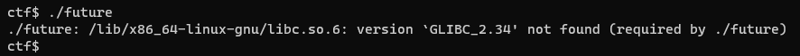
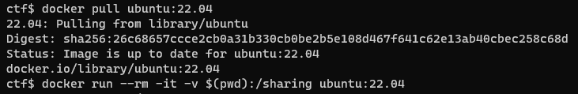
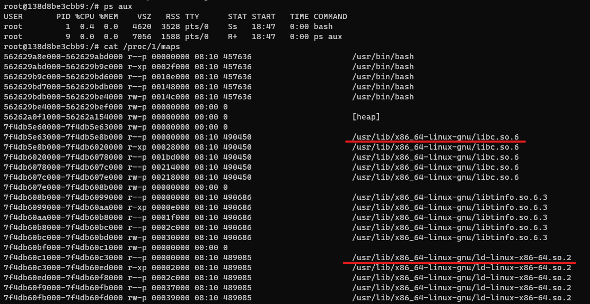
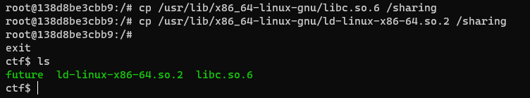
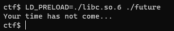

# Future

Found a strange [file](./task/future) on our server. We tried to launch it, but it doesn't seem to work... yet. We suspect this is a virus that will be executed in the future. Can you figure out what it is?

**Category**: Reverse

# Solution

Running the binary requires GLIBC 2.34.


Required version can be easily extracted from the Ubuntu 22.04 docker container (it actually uses GLIBC 2.35).





Changing the dynamic loader with [patchelf](https://github.com/NixOS/patchelf):
```
patchelf --set-interpreter ./ld-linux-x86-64.so.2 ./future
```
Now the binary can be run with `LD_PRELOAD=./libc.so.6 ./future`:


Let's open it in IDA Pro. You can download my [.i64 file](./solution/future.i64) and put it next to the binary to view the Hex-Rays output in IDA. 
```C
__int64 __fastcall main(int a1, char **a2, char **a3)
{
  unsigned int v4; // eax
  _BYTE *v5; // r12
  _BYTE *v6; // r14
  __int64 v7; // r15
  void *v8; // r14
  int v9; // er12

  v4 = time(0LL);
  srand(v4);
  v5 = calloc(1uLL, 0x100uLL);
  v6 = v5;
  do
    *v6++ = rand() % 256;
  while ( v6 != v5 + 256 );
  v7 = (unsigned int)n;
  v8 = calloc(1uLL, (unsigned int)n);
  sub_12D0((__int64)&unk_40A0, v7, (__int64)v5, 256LL, (__int64)v8);
  v9 = memfd_create("timer", 1LL);
  write(v9, v8, (unsigned int)n);
  fexecve(v9, a2, a3);
  puts("Your time has not come...");
  return 0LL;
}
```
After careful "digging" I ended up with this:
```C
__int64 __fastcall main(int a1, char **a2, char **a3)
{
  unsigned int seed; // eax
  char *bufRand; // r12
  char *bufRand_; // r14
  size_t ELF_SIZE_; // r15
  char *ELF_buf; // r14
  int RAM_file; // er12

  seed = time(0LL);
  srand(seed);
  bufRand = (char *)calloc(1uLL, 256uLL);
  bufRand_ = bufRand;
  do
    *bufRand_++ = rand() % 256;
  while ( bufRand_ != bufRand + 256 );
  ELF_SIZE_ = (unsigned int)ELF_SIZE;           // n=0xbd468 = 775 272 | ELF_SIZE <-> encryptedBytes SIZE


  ELF_buf = (char *)calloc(1uLL, (unsigned int)ELF_SIZE);
  decryptElf(encryptedBytes, ELF_SIZE_, bufRand, 256uLL, ELF_buf);
  RAM_file = memfd_create("timer", 1LL);        // MFD_CLOEXEC
  write(RAM_file, ELF_buf, (unsigned int)ELF_SIZE);
  fexecve(RAM_file, a2, a3);
  puts("Your time has not come...");
  return 0LL;
}
```
1. Firstly, libc PRG is initialized with `time(0)`.
2. Then a 256-byte-long buffer is filled with values in range [0-255]. 
3. Then previously initialized buffer is passed to the function `decryptElf`.
4. `decryptElf` decrypts ELF file and stores it in `ELF_buf`.
5. `ELF_buf` is then written to a in-memory file "time" and executed.
6. If `fexecve` fails, `Your time has not come...` will be printed.

Let's look at `sub_12D0` aka `decryptElf`.
```C
unsigned __int64 __fastcall sub_12D0(__int64 a1, __int64 a2, __int64 a3, __int64 a4, __int64 a5)
{
  __int64 v8; // rsi
  char *v9; // rcx
  char *v10; // rdx
  unsigned int v11; // edi
  char v12; // si
  char v13; // al
  char v14; // r11
  __int64 v15; // rsi
  unsigned int v16; // er11
  unsigned int v17; // edi
  char v18; // bl
  char v19; // al
  _BYTE v21[256]; // [rsp+0h] [rbp-218h] BYREF
  __int128 v22[16]; // [rsp+100h] [rbp-118h] BYREF
  char v23; // [rsp+200h] [rbp-18h] BYREF
  unsigned __int64 v24; // [rsp+208h] [rbp-10h]

  v8 = 0LL;
  v24 = __readfsqword(0x28u);
  v9 = v21;
  v22[0] = (__int128)_mm_load_si128((const __m128i *)&xmmword_2030);
  v22[1] = (__int128)_mm_load_si128((const __m128i *)&xmmword_2040);
  v22[2] = (__int128)_mm_load_si128((const __m128i *)&xmmword_2050);
  v22[3] = (__int128)_mm_load_si128((const __m128i *)&xmmword_2060);
  v22[4] = (__int128)_mm_load_si128((const __m128i *)&xmmword_2070);
  v22[5] = (__int128)_mm_load_si128((const __m128i *)&xmmword_2080);
  v22[6] = (__int128)_mm_load_si128((const __m128i *)&xmmword_2090);
  v22[7] = (__int128)_mm_load_si128((const __m128i *)&xmmword_20A0);
  v22[8] = (__int128)_mm_load_si128((const __m128i *)&xmmword_20B0);
  v22[9] = (__int128)_mm_load_si128((const __m128i *)&xmmword_20C0);
  v22[10] = (__int128)_mm_load_si128((const __m128i *)&xmmword_20D0);
  v22[11] = (__int128)_mm_load_si128((const __m128i *)&xmmword_20E0);
  v22[12] = (__int128)_mm_load_si128((const __m128i *)&xmmword_20F0);
  v22[13] = (__int128)_mm_load_si128((const __m128i *)&xmmword_2100);
  v22[14] = (__int128)_mm_load_si128((const __m128i *)&xmmword_2110);
  v22[15] = (__int128)_mm_load_si128((const __m128i *)&xmmword_2120);
  do
  {
    v21[v8] = *(_BYTE *)(a3 + v8 % a4);
    ++v8;
  }
  while ( v8 != 256 );
  v10 = (char *)v22;
  LOBYTE(v11) = 0;
  do
  {
    v12 = *v10;
    v13 = *v9;
    ++v10;
    ++v9;
    v11 = (unsigned __int8)(v11 + v12 + v13);
    v14 = *((_BYTE *)v22 + v11);
    *((_BYTE *)v22 + v11) = v12;
    *(v10 - 1) = v14;
  }
  while ( &v23 != v10 );
  if ( a2 > 0 )
  {
    v15 = 0LL;
    LOBYTE(v16) = 0;
    LOBYTE(v17) = 0;
    do
    {
      v16 = (unsigned __int8)(v16 + 1);
      v18 = *((_BYTE *)v22 + v16);
      v17 = (unsigned __int8)(v18 + v17);
      v19 = *((_BYTE *)v22 + v17);
      *((_BYTE *)v22 + v17) = v18;
      *((_BYTE *)v22 + v16) = v19;
      *(_BYTE *)(a5 + v15) = *(_BYTE *)(a1 + v15) ^ *((_BYTE *)v22 + (unsigned __int8)(*((_BYTE *)v22 + v17) + v19));
      ++v15;
    }
    while ( a2 != v15 );
  }
  return v24 - __readfsqword(0x28u);
}
```
After more "digging" I ended up with this:

```C
unsigned __int64 __fastcall decryptElf(char *encryptedBytes, size_t ELF_SIZE, char *bufRand, size_t bufRandSz, char *ELF_buf)
{
  __int64 i; // rsi
  char *bufRandCopy_; // rcx
  char *WORDS_BYTE_PTR; // rdx
  int sum; // edi
  char wordsChar; // si
  char bufRandChar; // al
  char tmp; // r11
  __int64 byte_index; // rsi
  int a; // er11
  int b; // edi
  char words_charA; // bl
  char words_charB; // al
  _BYTE bufRandCopy[256]; // [rsp+0h] [rbp-218h] BYREF
  char WORDS[256]; // [rsp+100h] [rbp-118h] BYREF
  char v23; // [rsp+200h] [rbp-18h] BYREF
  unsigned __int64 canary; // [rsp+208h] [rbp-10h]

  i = 0LL;
  canary = __readfsqword(40u);
  bufRandCopy_ = bufRandCopy;
  *(__m128i *)WORDS = _mm_load_si128((const __m128i *)byte_555555556030);
  *(__m128i *)&WORDS[16] = _mm_load_si128((const __m128i *)&byte_555555556030[16]);
  *(__m128i *)&WORDS[32] = _mm_load_si128((const __m128i *)&byte_555555556030[32]);
  *(__m128i *)&WORDS[48] = _mm_load_si128((const __m128i *)&byte_555555556030[48]);
  *(__m128i *)&WORDS[64] = _mm_load_si128((const __m128i *)&byte_555555556030[64]);
  *(__m128i *)&WORDS[80] = _mm_load_si128((const __m128i *)&byte_555555556030[80]);
  *(__m128i *)&WORDS[96] = _mm_load_si128((const __m128i *)&byte_555555556030[96]);
  *(__m128i *)&WORDS[112] = _mm_load_si128((const __m128i *)&byte_555555556030[112]);
  *(__m128i *)&WORDS[128] = _mm_load_si128((const __m128i *)&byte_555555556030[128]);
  *(__m128i *)&WORDS[144] = _mm_load_si128((const __m128i *)&byte_555555556030[144]);
  *(__m128i *)&WORDS[160] = _mm_load_si128((const __m128i *)&byte_555555556030[160]);
  *(__m128i *)&WORDS[176] = _mm_load_si128((const __m128i *)&byte_555555556030[176]);
  *(__m128i *)&WORDS[192] = _mm_load_si128((const __m128i *)&byte_555555556030[192]);
  *(__m128i *)&WORDS[208] = _mm_load_si128((const __m128i *)&byte_555555556030[208]);
  *(__m128i *)&WORDS[224] = _mm_load_si128((const __m128i *)&byte_555555556030[224]);
  *(__m128i *)&WORDS[240] = _mm_load_si128((const __m128i *)&byte_555555556030[240]);
  do
  {
    bufRandCopy[i] = bufRand[i % (__int64)bufRandSz];//  just copies bufRand
    ++i;
  }
  while ( i != 256 );


  WORDS_BYTE_PTR = WORDS;
  LOBYTE(sum) = 0;
  do
  {
    wordsChar = *WORDS_BYTE_PTR;
    bufRandChar = *bufRandCopy_;
    ++WORDS_BYTE_PTR;
    ++bufRandCopy_;
    sum = (unsigned __int8)(sum + wordsChar + bufRandChar);


    tmp = WORDS[sum];
    WORDS[sum] = wordsChar;
    *(WORDS_BYTE_PTR - 1) = tmp;
  }
  while ( &v23 != WORDS_BYTE_PTR );             // &v23 - first byte after WORDS
                                                // 


  if ( (__int64)ELF_SIZE > 0 )
  {
    byte_index = 0LL;
    LOBYTE(a) = 0;
    LOBYTE(b) = 0;
    do
    {

      a = (unsigned __int8)(a + 1);

      words_charA = WORDS[a];


      b = (unsigned __int8)(words_charA + b);


      words_charB = WORDS[b];


      WORDS[b] = words_charA;
      WORDS[a] = words_charB;


      ELF_buf[byte_index] = encryptedBytes[byte_index] ^ WORDS[(unsigned __int8)(WORDS[b] + words_charB)];
      ++byte_index;
    }
    while ( ELF_SIZE != byte_index );
  }
  return canary - __readfsqword(0x28u);
```

Not much help though. When competition ended, people in the Telegram chat told that this is actually the [RC4 stream cipher](https://en.wikipedia.org/wiki/RC4).


The task description hints that you need to brute the seed: *"We suspect this is a virus that will be executed in the future"*.

 The following [straightforward single-threaded bruteforce implementation](./solution/brute.c) finds the correct seed in 46 minutes.


`encryptedBytes` is an encrypted ELF file so first four encrypted bytes `15 88 8C 0E` are actually an encrypted ELF file signature(magic) which is always equal to `7F 45 4C 46`. Thus, by decrypting first four bytes of `encryptedBytes` and comparing decrypted bytes with an ELF signature we can find the correct seed.


```C
#include <stdio.h>
#include <stdlib.h>
#include <string.h>

unsigned char ida_chars[] =
{
  0x00, 0x01, 0x02, 0x03, 0x04, 0x05, 0x06, 0x07, 0x08, 0x09, 
  0x0A, 0x0B, 0x0C, 0x0D, 0x0E, 0x0F, 0x10, 0x11, 0x12, 0x13, 
  0x14, 0x15, 0x16, 0x17, 0x18, 0x19, 0x1A, 0x1B, 0x1C, 0x1D, 
  0x1E, 0x1F, 0x20, 0x21, 0x22, 0x23, 0x24, 0x25, 0x26, 0x27, 
  0x28, 0x29, 0x2A, 0x2B, 0x2C, 0x2D, 0x2E, 0x2F, 0x30, 0x31, 
  0x32, 0x33, 0x34, 0x35, 0x36, 0x37, 0x38, 0x39, 0x3A, 0x3B, 
  0x3C, 0x3D, 0x3E, 0x3F, 0x40, 0x41, 0x42, 0x43, 0x44, 0x45, 
  0x46, 0x47, 0x48, 0x49, 0x4A, 0x4B, 0x4C, 0x4D, 0x4E, 0x4F, 
  0x50, 0x51, 0x52, 0x53, 0x54, 0x55, 0x56, 0x57, 0x58, 0x59, 
  0x5A, 0x5B, 0x5C, 0x5D, 0x5E, 0x5F, 0x60, 0x61, 0x62, 0x63, 
  0x64, 0x65, 0x66, 0x67, 0x68, 0x69, 0x6A, 0x6B, 0x6C, 0x6D, 
  0x6E, 0x6F, 0x70, 0x71, 0x72, 0x73, 0x74, 0x75, 0x76, 0x77, 
  0x78, 0x79, 0x7A, 0x7B, 0x7C, 0x7D, 0x7E, 0x7F, 0x80, 0x81, 
  0x82, 0x83, 0x84, 0x85, 0x86, 0x87, 0x88, 0x89, 0x8A, 0x8B, 
  0x8C, 0x8D, 0x8E, 0x8F, 0x90, 0x91, 0x92, 0x93, 0x94, 0x95, 
  0x96, 0x97, 0x98, 0x99, 0x9A, 0x9B, 0x9C, 0x9D, 0x9E, 0x9F, 
  0xA0, 0xA1, 0xA2, 0xA3, 0xA4, 0xA5, 0xA6, 0xA7, 0xA8, 0xA9, 
  0xAA, 0xAB, 0xAC, 0xAD, 0xAE, 0xAF, 0xB0, 0xB1, 0xB2, 0xB3, 
  0xB4, 0xB5, 0xB6, 0xB7, 0xB8, 0xB9, 0xBA, 0xBB, 0xBC, 0xBD, 
  0xBE, 0xBF, 0xC0, 0xC1, 0xC2, 0xC3, 0xC4, 0xC5, 0xC6, 0xC7, 
  0xC8, 0xC9, 0xCA, 0xCB, 0xCC, 0xCD, 0xCE, 0xCF, 0xD0, 0xD1, 
  0xD2, 0xD3, 0xD4, 0xD5, 0xD6, 0xD7, 0xD8, 0xD9, 0xDA, 0xDB, 
  0xDC, 0xDD, 0xDE, 0xDF, 0xE0, 0xE1, 0xE2, 0xE3, 0xE4, 0xE5, 
  0xE6, 0xE7, 0xE8, 0xE9, 0xEA, 0xEB, 0xEC, 0xED, 0xEE, 0xEF, 
  0xF0, 0xF1, 0xF2, 0xF3, 0xF4, 0xF5, 0xF6, 0xF7, 0xF8, 0xF9, 
  0xFA, 0xFB, 0xFC, 0xFD, 0xFE, 0xFF
};

unsigned char WORDS[256];


#define __int64 long
#define _BYTE unsigned char
#define __int8 char
#define LOBYTE(x)  (*(unsigned char *) &(x))

unsigned __int64 decryptElf(char *encryptedBytes, size_t ELF_SIZE, char *bufRand, size_t bufRandSz, char *ELF_buf)
{
  __int64 i; // rsi
  char *bufRandCopy_; // rcx
  char *WORDS_BYTE_PTR; // rdx
  int sum; // edi
  char wordsChar; // si
  char bufRandChar; // al
  char tmp; // r11
  __int64 byte_index; // rsi
  int a; // er11
  int b; // edi
  char words_charA; // bl
  char words_charB; // al
  _BYTE bufRandCopy[256]; // [rsp+0h] [rbp-218h] BYREF
  //char WORDS[256]; // [rsp+100h] [rbp-118h] BYREF
  char v23; // [rsp+200h] [rbp-18h] BYREF
  unsigned __int64 canary; // [rsp+208h] [rbp-10h]

  i = 0LL;
  //canary = __readfsqword(40u);
  bufRandCopy_ = bufRandCopy;
  // *(__m128i *)WORDS = _mm_load_si128((const __m128i *)byte_555555556030);
  // *(__m128i *)&WORDS[16] = _mm_load_si128((const __m128i *)&byte_555555556030[16]);
  // *(__m128i *)&WORDS[32] = _mm_load_si128((const __m128i *)&byte_555555556030[32]);
  // *(__m128i *)&WORDS[48] = _mm_load_si128((const __m128i *)&byte_555555556030[48]);
  // *(__m128i *)&WORDS[64] = _mm_load_si128((const __m128i *)&byte_555555556030[64]);
  // *(__m128i *)&WORDS[80] = _mm_load_si128((const __m128i *)&byte_555555556030[80]);
  // *(__m128i *)&WORDS[96] = _mm_load_si128((const __m128i *)&byte_555555556030[96]);
  // *(__m128i *)&WORDS[112] = _mm_load_si128((const __m128i *)&byte_555555556030[112]);
  // *(__m128i *)&WORDS[128] = _mm_load_si128((const __m128i *)&byte_555555556030[128]);
  // *(__m128i *)&WORDS[144] = _mm_load_si128((const __m128i *)&byte_555555556030[144]);
  // *(__m128i *)&WORDS[160] = _mm_load_si128((const __m128i *)&byte_555555556030[160]);
  // *(__m128i *)&WORDS[176] = _mm_load_si128((const __m128i *)&byte_555555556030[176]);
  // *(__m128i *)&WORDS[192] = _mm_load_si128((const __m128i *)&byte_555555556030[192]);
  // *(__m128i *)&WORDS[208] = _mm_load_si128((const __m128i *)&byte_555555556030[208]);
  // *(__m128i *)&WORDS[224] = _mm_load_si128((const __m128i *)&byte_555555556030[224]);
  // *(__m128i *)&WORDS[240] = _mm_load_si128((const __m128i *)&byte_555555556030[240]);
  do
  {
    bufRandCopy[i] = bufRand[i % (__int64)bufRandSz];//  just copies bufRand
    ++i;
  }
  while ( i != 256 );


  WORDS_BYTE_PTR = WORDS;
  LOBYTE(sum) = 0;
  do
  {
    wordsChar = *WORDS_BYTE_PTR;
    bufRandChar = *bufRandCopy_;
    ++WORDS_BYTE_PTR;
    ++bufRandCopy_;
    sum = (unsigned __int8)(sum + wordsChar + bufRandChar);


    tmp = WORDS[sum];
    WORDS[sum] = wordsChar;
    *(WORDS_BYTE_PTR - 1) = tmp;
  }
  while ( &WORDS[256] != WORDS_BYTE_PTR );
  //while ( &v23 != WORDS_BYTE_PTR );             // &v23 - first byte after WORDS
                                                // 


  if ( (__int64)ELF_SIZE > 0 )
  {
    byte_index = 0LL;
    LOBYTE(a) = 0;
    LOBYTE(b) = 0;
    do
    {

      a = (unsigned __int8)(a + 1);

      words_charA = WORDS[a];


      b = (unsigned __int8)(words_charA + b);


      words_charB = WORDS[b];


      WORDS[b] = words_charA;
      WORDS[a] = words_charB;


      ELF_buf[byte_index] = encryptedBytes[byte_index] ^ WORDS[(unsigned __int8)(WORDS[b] + words_charB)];
      ++byte_index;
    }
    while ( ELF_SIZE != byte_index );
  }
  //return canary - __readfsqword(0x28u);
	return 0x539;
}


int main()
{
	
	unsigned char ELF_ENCRYPTED_MAGICK[]={0x15, 0x88, 0x8C, 0x0E};
	unsigned char ELF_MAGICK[]={0x7f, 0x45, 0x4c, 0x46};
	unsigned char ELF_DECRYPTED[4];
	
	
	unsigned seed=time(0);
	//unsigned seed=0x000067C1BBFC; //1740749820
	unsigned char bufRand[256];
	
	
	for (;;)
	{
		memcpy(WORDS,ida_chars,256);
		memset(ELF_DECRYPTED,0,4);
		
		
		srand(seed);
		
		printf("Trying seed: %u\n",seed);
		
		for (int i=0;i<256;++i)
			bufRand[i]=rand()%256;
		
		
		
		decryptElf(ELF_ENCRYPTED_MAGICK,4,bufRand,256,ELF_DECRYPTED);
	
		if (memcmp(ELF_MAGICK,ELF_DECRYPTED,4)==0)
		{
			printf("Found seed: %u\n",seed);
			break;
		}
		
		++seed;
	}
	
	return 0;
}
```

Seed value is `1740749820`.

Now we can decrypt ELF file by breaking before `srand` in gdb and changing seed value (RDI register) to `1740749820`. Then by breaking after `write` we can retrive file from `/proc/pid/fd/3`.


Setting seed:


Break after decrypted ELF was written to an in-memory file.


Extracting decrypted ELF:


Extracted [binary](./solution/stage2.elf) prints the flag character by character very slowly.


Let's open it in IDA. It is a statically linked stripped binary so there are no function names. We saw that the binary before printing the flag prints *"Right time has come! Take your flag!"*. Let's look for that string in "Strings window" in IDA (Shift+F12).


Using XREFs we find `sub_40185D` and `sub_40178A`:


If you look inside `sub_443B50`, you will see that this is a GLIBC wrapper for the wrtie syscall.


Let's look inside `sub_4016DD`:


It takes a character *a1* and its index *a2* as arguments and then executes for-cycle until `i>v4*v5`.

In each iteration function `sub_4016A5` is called on a cahracter(a1) 65535 times.

`sub_4016A5` just xors a passed character with 1024 bytes.


So `sub_4016DD` loops until `i>v4*v5` and each iteration function `sub_4016A5`, which xors a character with 1024 bytes, is called 65535 times.

Let's just patch for-loop in which `sub_4016A5` is called so it would be called only once each iteration.

Unpatched opcode:


Patched:


Now the binary will print the flag:


Flag: `VolgaCTF{m4n_y0u_c4n_d3f1n1t3ly_see_th3_fu7ur3}`